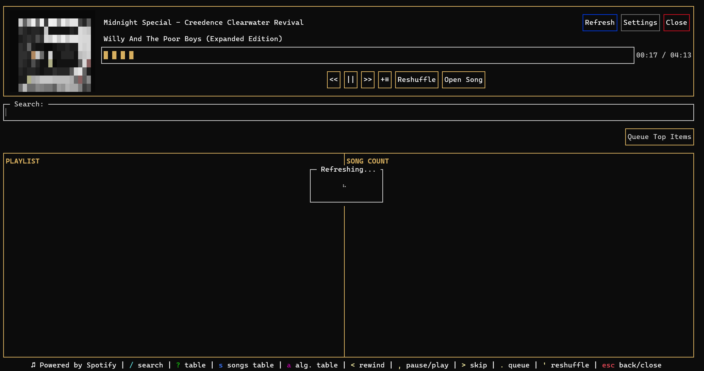
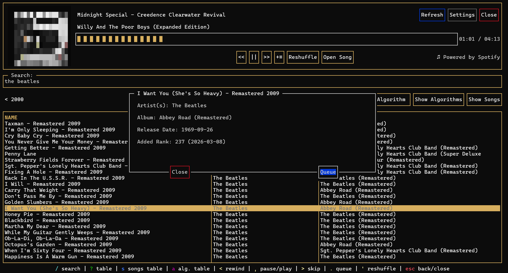
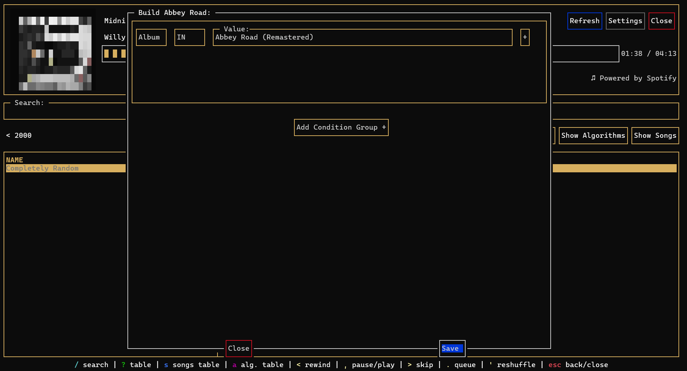
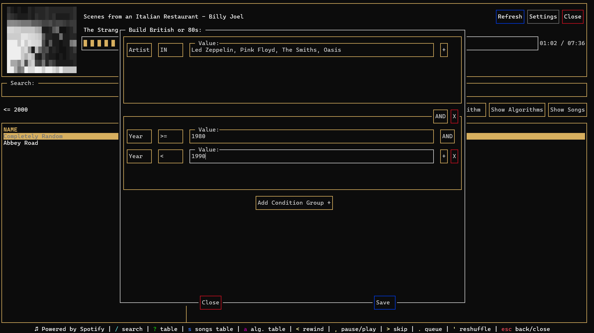
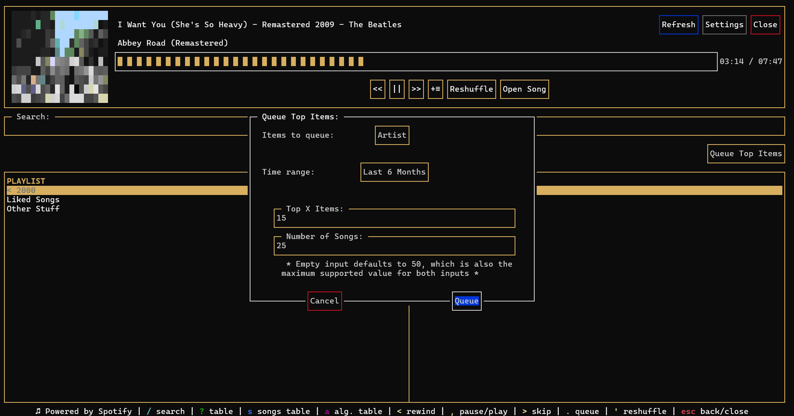
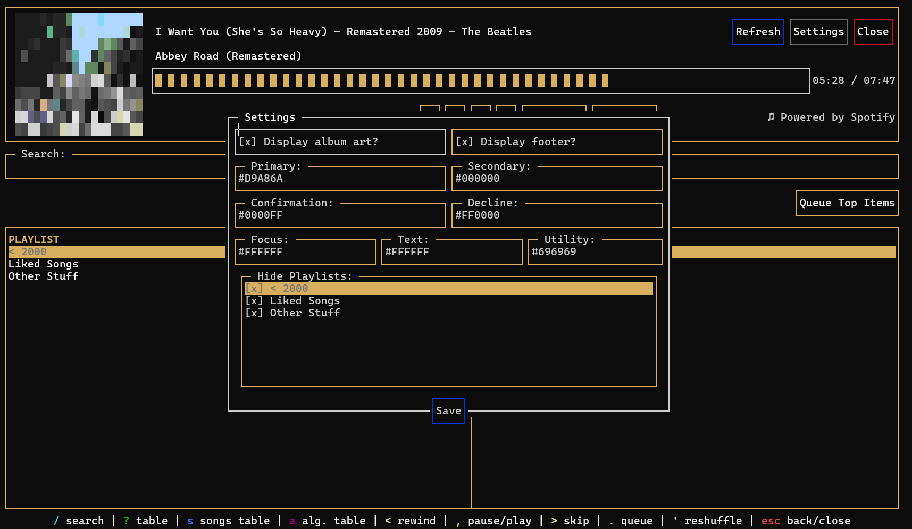

<pre>
         ___
        /\  \  
       /  \  \                                   |\
      /    \  \       ⎺⎺⎺⎻-⎽_          _⎽-⎻⎺⎺⎺⎺⎺⎺⎺  \
     /      \  \            ⎺⎺⎻-⎽__⎽-⎻⎺⎺            /
    /        \  \     ⎺⎺⎺⎻-⎽_     ⎺⎺⎻-⎽__⎽-⎻⎺⎺⎺⎺⎺⎺|/
   /          \  \    ___⎽-⎻⎺⎺⎺⎻-⎽_      ⎺⎺⎻-⎽____|\
  /            \  \         _⎽-⎻⎺⎺⎺⎻-⎽_             \
 /              \  \  ___⎽-⎻⎺⎺          ⎺⎺⎻-⎽______ /
/________________\__\                             |/ 
</pre>

# Delta Shuffler

#### A local, terminal-based Spotify wrapper

---

## Contents:
- [About](#about)
- [User Guide](#user-guide)
  - [Installation](#installation)
  - [Setup](#setup)
  - [Queueing Songs](#queueing-songs)
  - [Creating and Running Algorithms](#creating-and-running-algorithms)
  - [Dependent Playlists](#dependent-playlists)
  - [Queueing Top Items](#queueing-top-items)
  - [Settings](#settings)
  - [Keybindings](#keybindings)
  - [FAQ](#faq)
    - [Music playback](#can-i-listen-to-music-through-delta-shuffler)
    - [Missing playlists](#some-of-my-playlists-arent-available-to-download)
    - [Non-premium support](#is-there-support-for-non-premium-users)
  - [Uninstalling](#uninstalling)
- [Design Decisions](#design-decisions)
  - [Why a TUI?](#why-a-tui)
  - [No local database?](#no-local-database)
  - [No mouse support?](#no-mouse-support)
  - [Versioning standard](#versioning-standard)
- [Future Improvements](#future-improvements)

---

## About

Delta Shuffler is a text-based user interface (TUI) that gives users greater control over their Spotify libraries. As someone who is constantly listening to music, I've found myself frustrated with Spotify's default algorithm. While the company has [claimed recent improvements](https://engineering.atspotify.com/2025/11/shuffle-making-random-feel-more-human), I still find myself unsatisfied with the product. Random shuffling tools are pretty common ([I](https://stevenaleong.com/tools/spotifyplaylistrandomizer) [found](https://trackify.am/tools/playlist-randomizer-spotify) [three](https://shuffle.virock.org) in about 10 seconds of searching), though, and Spotify [maintains](https://engineering.atspotify.com/2025/11/shuffle-making-random-feel-more-human#:~:text=Standard%20Shuffle%3A%20still%20pure%20randomness) that its Standard Shuffle is entirely random. A few features differentiate this tool from alternatives:
- Delta Shuffler is run locally and, aside from calls to Spotify, is completely isolated to the user's machine. This keeps users in control of their API tokens without outsourcing them to any third-party servers
- Most alternatives only offer random shuffling. This project expands on that functionality by allowing users to create custom Algorithms and Dependent Playlists
- Other services remove and add tracks to users' playlists when shuffling, modifying the playlist's original order. Delta Shuffler avoids this by queuing songs rather than modifying users' playlists

The overall goal of this project was to create functionality similar to [iTunes' Smart Playlists](https://support.apple.com/guide/itunes/create-delete-and-use-smart-playlists-itns3001/windows). Spotify seems reluctant to grant users greater control over their playlists and algorithms given their focus on AI, so no solution is likely coming from them.

---

## User Guide

### Installation
To install, either:
- Clone the repo (`node v20.0.0` or later requried). Run `npm i` to download all dependencies before `node shuffler.js` to launch the app.
- Download a release file from [here](https://github.com/awimmel/delta-shuffler/releases/latest). Run the downloaded file from your terminal of choice.
  - Windows builds contain a `.exe` and a `.bat` file. You can run the `.exe` directly from your terminal or click the `.bat` to automatically launch a terminal for you
  - macOS will not originally recognize the file as a program. Run `chmod +x <downloaded_file_name>` to give yourself priveleges to execute the file. After this you can run the program, but you will likely have to override macOS' security protections via the Privacy & Security Settings page.

### Setup

Go to https://developer.spotify.com and sign in. From there, navigate to your Dashboard and create an app. Set the following information:

- App name/description: whatever works best for you. "Delta Shuffler" is recommended, but anything should work
- Redirect URIs: http://127.0.0.1:3438/spotifyLogin
  - This redirects Spotify's authorization response to your local application, preventing the need for any external servers
- API/SDKs: Web API

Once your app is created, boot up Delta Shuffler. Enter your Client ID and Client Secret and authenticate. Successful authentication should route you to a local web page, after which the app will prompt you to begin downloading your playlists and Liked Songs. __Recent Spotify API changes have significantly limited the number of requests per application. It is recommended that you only download your most frequently used playlists to avoid any issues.__

From here, you can view any playlist, its songs, and its default "Completely Random" Algorithm. While Spotify maintains that it provides a completely random option, I figured it was worth adding for anyone who doesn't trust them.

Refresh the application whenever you make changes on Spotify that you would like to be reflected in Delta Shuffler. Refreshing can take a bit of time, so be careful to not do it too frequently.

### Queueing Songs

Users can queue songs directly via the Songs view. Navigate to the Show Songs button (or hit `s`), filter by whatever song you're looking for, and select it to see more information:

Note that you must already be listening to a song on Spotify for this to work properly. A good rule to follow is that if you see a song title in the top left corner, you should be good to queue.

### Creating and Running Algorithms

Algorithms are at the heart of Delta Shuffler's functionality. With an Algorithm, you can randomly shuffle any of a playlist's songs that meet user-defined conditions. Algorithms can filter on something simple, like a playlist's songs being on _Abbey Road_:

Algorithms can also filter in more complex ways, like retrieving songs that were performed by a few British groups or released in the 80s:

After creating an Algorithm, you can randomly queue songs that match its criteria. Up to 50 matching songs can be added to your queue at once. Again, to queue a song, you must be already listening to something on Spotify.

Values for `Album`, `Artist`, and `Song` filters must match their target **exactly**. For example, use "Stairway to Heaven - Remaster" and not "Stairway to Heaven". `IN`/`NOT IN` operators support multiple elements, but they must be separated by a `, `. Ideally a multi-select, searchable dropdown would be used here, but that proved to be too difficult to create in Blessed (the project's TUI library). The `Added` condition corresponds to how recently a song was added to your playlist. Values begin at 1 and lower values correspond to more recent songs. So, a song with a value of 1 was your playlist's most recent addition.

### Dependent Playlists

If you really like an Algorithm, you can create a Dependent Playlist from it. Select an Algorithm and the "Create Playlist" option, give your playlist a name, and your new Dependent Playlist will be visible in your Spotify library. Refreshing in Delta Shuffler also updates Dependent Playlists in Spotify.

As an example, you can use the "Added" condition to create a Dependent Playlist with your source's 30 most recently added songs. Songs will be added/removed as your source playlist changes, giving you a trimmed-down version of a longer playlist.

Note: If you're interested in a Spotify-native solution, Spotify's new [AI playlist feature](https://support.spotify.com/us/article/ai-playlist/) seems to work pretty well and can accomplish similar playlist filtering. Dependent Playlists are still a great option if you're looking to quickly create a playlist based on an existing Algorithm.

### Queueing Top Items

Users can also queue their top artists or songs from the Queue Top Items button. Top items will be retrieved depending on the user-selected timeframe (`Last Month`, `Last 6 Months`, `Last Year`) and the `Top X Items` limit that the user provides.

The following input queues 25 songs from the user's top 15 artists over the past 6 months. Artist's songs are retrieved from tracks that are on downloaded playlists:

### Settings

Album art and footer display options, theming, and hiding playlists are all controlled from the Settings page:

### Keybindings

| Key | Action |
| --- | --------- |
| ↑ / ↓ / ← / →  | Navigate |
|  /  | Search |
|  c  | Clear search |
|  ?  | Current table |
|  s  | Show Songs table (if viewing playlist)|
|  a  | Show Algorithms table (if viewing playlist)|
|  <  | Rewind |
|  ,  | Pause/Play |
|  >  | Skip |
|  .  | Queue |
|  '  | Reshuffle |
| esc | Close |

It's important to note that navigation is handled **entirely** by the keyboard. There is no mouse support for interacting with the application.

### FAQ

#### Can I listen to music through Delta Shuffler?

Spotify's [Web Playback SDK](https://developer.spotify.com/documentation/web-playback-sdk) provides audio playback options, but this application was never intended to completely replace your Spotify player. You should still plan to listen to tracks in Spotify. While I may add player funcitonality in the future, I was looking to avoid feature creep on a smaller personal project.

#### Some of my playlists aren't available to download!

Only user-owned and user-collaborated playlists are available to download. This is due to a restriction on downloading playlist tracks from Spotify's API ([here](https://developer.spotify.com/documentation/web-api/reference/get-playlists-items)). If there is an unavailable playlist that you'd like, try creating a personal copy of the playlist to download.

#### Is there support for non-premium users?

Unfortunately, users must be Spotify Premium subscribers to access the [Web API](https://developer.spotify.com/documentation/web-api).

### Uninstalling

Uninstalling is as simple as removing the repo/application file and deleting the `delta-shuffler` directory from your `AppData` or `.config` folder.

---
## Design Decisions

### Why a TUI?

A TUI best aligned with my goals for this project to be lightweight and entirely local. A local web application or an Electron app would both have been too much for the application's needs. Selfishly, I also wanted to learn more about TUIs through this project. Using programs like Vim and [k9s](https://github.com/derailed/k9s) made me more interested in these applications.

One downside of making a TUI is a limited audience; web-based and Electron applications are rightly popular for their greater reach with less savvy audiences. Given the nature of the application, however, I was willing to accept this downside. I figured that most users nerdy enough to want custom shuffling algorithms would be happy to run a program through their terminal :smile:.

### No local database?

I opted against running a local database to keep the application particularly lightweight. User data is stored in JSON files instead. Given a typical user's data volume and the low number of JOINs, this seemed to be the best option. To handle the M:N relationship between Songs and Playlists, I created the `playlistSongs.json` file, which stores `playlistId`, `songId`, `addedAt`, and `addedRank` attributes.

Still, I should optimize data read/write operations. Much of the current logic is undoubtedly inefficient, and I'm sure I can find more optimal routes to perform our database operations.

### No mouse support?

I decided not to add mouse support because I imagined it would interfere with the "retro vibe" I was looking to create. I'm aware this is a pretty weak argument, but I never imagined using a mouse to interact with the application :man_shrugging:.

I added keyboard shortcuts to make navigation easier. I recommend leveraging those if you find yourself frustrated with the application.

### Versioning standard

Full Semantic Versioning felt too detailed for such a small project. I opted for a two-number, `MAJOR.MINOR` versioning system. What constitutes a major/minor release will mainly just be left up to my own judgment. Versions with a suffix are experimental releases. `1.0-alpha` is the first Alpha release for `1.0`, and `1.3-beta` is the Beta release for `1.3`. 

---

## Future improvements

While currently in a working state, there are many things I hope to improve about this application:

- ~~Fix macOS builds~~
  - ~~macOS builds have hit a lot of issues that I haven't seen when running via Node on my Mac. I hope to fix these and provide proper build files to macOS users.~~
- Genre filtering
  - Genre filtering was previously supported, but was removed after being deprecated by Spotify's recent API changes. Running Algorithms based on certain genres would be a helpful feature, and I hope to find a suitable way to retrieve genres soon.
- Code quality
  - Given the non-reactive nature of Blessed, I resorted to some bad practices to get everything working properly. I could really stand to implement a few design patterns to reduce coupling throughout the code base. I would also like to add some linting to organize each file's imports.
- Player functionality
  - It would be nice if users could listen to tracks directly in their terminal. I have no idea what this would look like, but it could be worth investigating in the future.
- Provide a proper installer
  - A proper installer would go a long way in improving user experience, especially for those who are less technical.